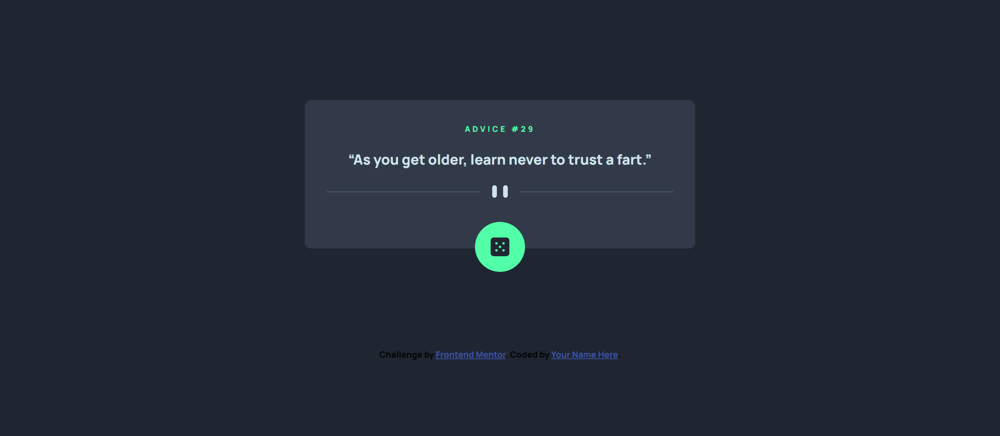
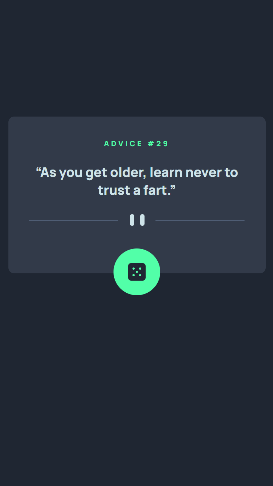

# Frontend Mentor - Advice generator app solution

This is a solution to the [Advice generator app challenge on Frontend Mentor](https://www.frontendmentor.io/challenges/advice-generator-app-QdUG-13db). Frontend Mentor challenges help you improve your coding skills by building realistic projects.

## Table of contents

- [Overview](#overview)
  - [The challenge](#the-challenge)
  - [Screenshot](#screenshot)
  - [Links](#links)
- [My process](#my-process)
  - [Built with](#built-with)
  - [What I learned](#what-i-learned)
  - [Continued development](#continued-development)
  - [Useful resources](#useful-resources)

**Note: Delete this note and update the table of contents based on what sections you keep.**

# Overview

This is the solution for the "Advice generator app" project from Frontend Mentor. The app is designed to generate random advice for users, providing them with inspirational or thought-provoking messages.

### The challenge

Users should be able to:

- View the optimal layout for the app depending on their device's screen size
- See hover states for all interactive elements on the page
- Generate a new piece of advice by clicking the dice icon

### Screenshot




### Links

- Solution URL: [Add solution URL here](https://github.com/TRIPLE-ADE/Advice-generator)
- Live Site URL: [Add live site URL here](https://triple-ade.github.io/Advice-generator/)

# My process

## 1. Project Planning

- Analyze the project requirements and specifications provided by Frontend Mentor.
- Break down the project into smaller tasks and define the scope of work.
- Determine the technologies and tools to be used, such as HTML, CSS, and JavaScript.
- Set up the project structure and version control system (e.g., Git).

## 2. Design and Styling

- Implement the base HTML structure according to the design.
- Style the app using CSS, ensuring responsiveness and visual appeal.
- Test the design and layout across different devices and screen sizes.

## 3. Fetching Data from API

- Write JavaScript code to fetch data from the API using the `async fetch()`.
- Parse the response data and extract the necessary information.
- Update the UI dynamically with the fetched advice content.

## 4. User Interaction

- Implement event handling for user interactions, such as clicking the dice button.
- Write JavaScript functions to generate and display new advice on button click.
- Update the advice ID and content in the UI accordingly.

## 5. Testing and Debugging

- Test the app's functionality thoroughly, checking for any bugs or errors.
- Debug any issues encountered during testing, ensuring smooth operation.
- Perform cross-browser testing to ensure compatibility across different web browsers.
- Optimize the app's performance and responsiveness.

## 6. Documentation and Deployment

- Document the project's README file, providing an overview, installation instructions, and usage guidelines.
- Add any necessary attribution.
- Deploy the app to a hosting platform or provide instructions for running it locally.
- Test the deployed version to ensure it works as expected in a live environment.

## 7. Final Review and Submission

- Review the completed project, ensuring it meets all the requirements.
- Double-check for any remaining bugs or issues and fix them.
- Submit the project solution to Frontend Mentor for evaluation.


### Features

- Random Advice: Users can click the dice button to generate a new piece of advice each time.
- Unique Advice ID: Each advice generated is associated with a unique ID, which is displayed along with  the advice content.
- Responsive Design: The app is built with a responsive layout, ensuring optimal viewing experience on various devices.

### Built with

- Semantic HTML5 markup
- CSS custom properties
- Flexbox
- CSS Grid
- Mobile-first workflow
- jS
- Advice API

### What I learned

```js
async function fetchAPI(slip_id) {
  try {
    const res = await fetch(`https://api.adviceslip.com/advice/${slip_id}`);
    if (!res.ok) {
      throw new Error('Network response was not ok');
    }
    const data = await res.json();
    updateUI(data);
  } catch (error) {
    console.error(error);
  }
}
```

### Continued development

- JavaScript DSA
- API integration
- React


